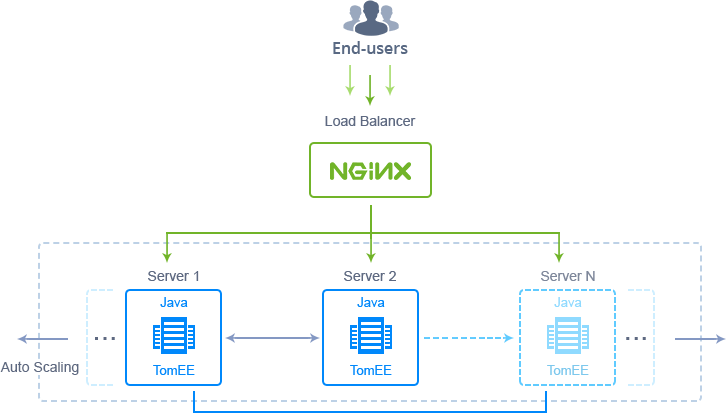
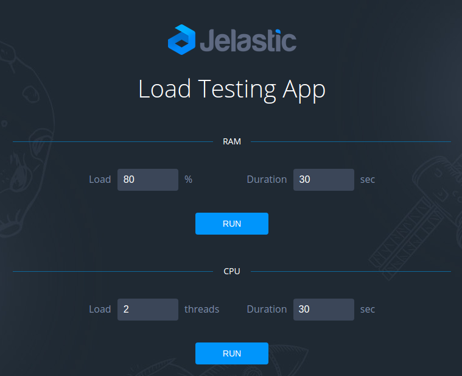

# TomEE Cluster

Reliable and auto-scalable [TomEE](http://tomee.apache.org//#) Сluster with preconfigured alerts on high load and built-in application for load testing.

## TomEE Cluster Topology

During installation, the TomEE Cluster package allows to define a number of included application server containers (up to 10 nodes) to subsequently automatically adjust their count by [scaling in/out](https://docs.jelastic.com/automatic-horizontal-scaling) when it becomes necessary to handle the increased amount of incoming traffic.

Current clustered TomEE solution is implemented upon the following specifics:
- *Load balancer* (LB) - dockerized template with **_NGINX 1.10.1_** 
- *Application server* (AS) - dockerized template with **_TomEE 7.0.1_** on top of **_Java 8_**

Herewith, each LB and AS container is provisioned with predefined [vertical scaling](https://docs.jelastic.com/automatic-vertical-scaling) limit up to **16 cloudlets** (equals to 2 GiB of RAM and 6.4 GHz of CPU) and a set of [load alerts](https://docs.jelastic.com/load-alerts) (to notify you when resource consumption comes close to instance threshold). In addition, connection to the cluster is secured with [Jelastic SSL](https://docs.jelastic.com/jelastic-ssl). 

Subsequently, any of these default settings can be adjusted - refer to the appropriate above-linked guides for the details.

## Auto-Scaling Configuration

The TomEE Cluster package automatically changes the number of application servers (up to 10 instances per layer) based on the consumption of resources as follows:
- +1 node if RAM/CPU usage is >70% for at least 5 minutes (up to 10 instances)
- -1 node if RAM/CPU usage is <40% for at least 5 minutes (but not less than a number of servers specified during installation)

The appropriate modifications are automatically applied to add or remove Spring Boot nodes, whilst you receive an email message about the corresponding scaling operation. 

In case you’d like to change the conditions of automatic scaling manually, adjust the appropriate triggers by following the [Automatic Horizontal Scaling](https://docs.jelastic.com/automatic-horizontal-scaling) guide.

## How to Install Auto-Scalable TomEE Cluster

In order to get TomEE Cluster solution instantly deployed, click the **Deploy to Jelastic** button below and specify your email address within the opened widget. Then choose one of the [Jelastic Public Cloud](https://jelastic.cloud) providers (in case you don’t have an account at the appropriate platform, it will be created automatically) and click **Install**.

To install the package manually, log in to the Jelastic dashboard with your credentials and [import](https://docs.jelastic.com/environment-import) link to the [**_manifest.jps_**](https://github.com/jelastic-jps/tomee/blob/master/manifest.jps) file (alternatively, you can locate this package via [Jelastic Marketplace](https://docs.jelastic.com/marketplace), *Clusters* section).

In the installation window, specify the following details: 
* **_Nodes in Cluster_** - number of application server instances your cluster should include
* choose deployment type:
   - **_Clean Cluster_** - to create bare cluster with no application inside
   - **_Deploy WAR_** - to deploy WAR application from the linked repo (where the default link is a project for load testing)

Type environment name and, optionally, *Display Name* ([alias](https://docs.jelastic.com/environment-aliases)). Also, select the preferable [region](https://docs.jelastic.com/environment-regions) (if several ones are available) and click **Install**.

Wait a few minutes for Jelastic to prepare environment and configure the auto-scaling settings.

## Load Testing with Default App

The TomEE Cluster package comes with a default **Load Testing App**, which repository is linked via the *WAR URL* box (unless you preferred to install *Clean Cluster* or linked your own application). It is deployed to the application server’s *ROOT* context and provides options for RAM and CPU loading. 

Load Testing App can be used to check the cluster behavior under simulated load alterations.  To launch the app click **Open in browser** next to the ROOT context. 

Depending on the resource type you’d like to simulate the load for (RAM or CPU), fill in the appropriate parameters:
- **_Load_** - amount of resources to generate (in % for RAM and *threads* for CPU)
- **_Duration_** - testing time (in *seconds*)

Click **Run** for the appropriate section to start loading. The process of new nodes automatic addition/removal can be tracked via the built-in dashboard tools, such as [statistics monitoring](https://docs.jelastic.com/view-app-statistics), [log files](https://docs.jelastic.com/view-log-files), and [scaling triggers history](https://docs.jelastic.com/automatic-horizontal-scaling#history).
